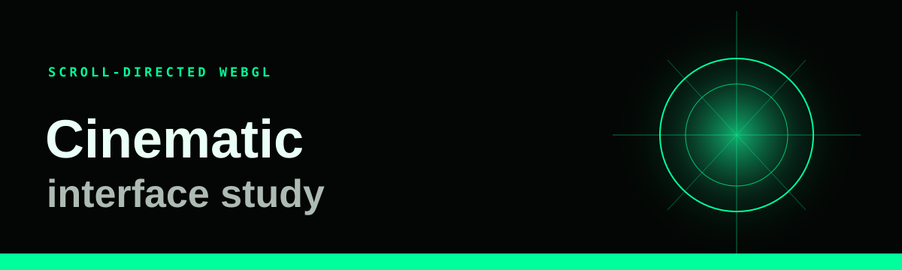

<div align="center">
  
</div>

# Cinematic interface study


A non-commercial front-end study of scroll-directed storytelling, layered video and real-time WebGL atmosphere. The project combines a fixed visual stage with a long scroll track so each section behaves like a controllable sequence rather than a set of separate pages.

This is an independent fan-made study. It is not affiliated with, sponsored by, or endorsed by Marvel, Disney, or any film studio. Character names, trademarks, footage and related properties belong to their respective owners.

**[Open the live web experience](https://doomsday.antideploy.com)**

## Technical approach

- Next.js 16, React 19 and TypeScript
- GSAP ScrollTrigger for the master scroll timeline
- Three.js and React Three Fiber for particles, fog, lighting and the procedural model
- Native video elements for frame seeking and playback
- Zustand for discrete interface state
- Lenis for optional smooth scrolling
- Responsive CSS modules and reduced-motion handling
- Static export for low-overhead hosting
- Anonymous visit and appreciation counters, plus project-specific legal pages

The main timeline writes progress into a mutable signal layer in `lib/signals.ts`. WebGL and DOM overlays read those values without routing every animation frame through React state.

## Project map

```text
app/                  Next.js entry point, metadata and global styles
components/           Experience timeline, overlays, interface and WebGL scene
components/overlays/  Video, story, reel and title sequences
components/webgl/     Camera, particles, fog, lightning and model scene
lib/                  Timeline constants, signals, state and media helpers
public/               Local media used by the prototype
```

## Run locally

Requirements: Node.js 20.9 or newer and npm.

```bash
npm ci
npm run dev
```

Open `http://localhost:3000`. To create the production-ready static export:

```bash
npm run build
```

The deployable site is written to `out/`. Serve that directory with any static web server when testing the exported build.

## Accessibility and performance

- The interface reads the operating system reduced-motion preference.
- Video playback is muted and limited to relevant sections.
- WebGL resolution adapts to the device pixel ratio.
- Scroll-scrubbed footage uses native video elements rather than WebGL textures.
- The production route is statically rendered.

## Media rights

The repository contains fan-project media associated with third-party entertainment properties. A disclaimer does not grant redistribution or deployment rights. Before using this project publicly, replace every third-party video, image, name and mark with material you created or are licensed to use. Do not present this repository as an official production.

## Verification

```bash
npm audit
npm run build
```

The dependency lockfile is maintained with zero known npm audit findings at the time of the latest repository update.

Maintainers signed in to Antideploy can publish a verified source bundle with `python scripts/deploy_antideploy.py`.

